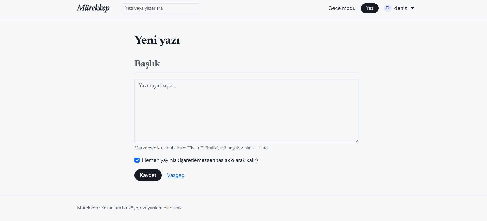
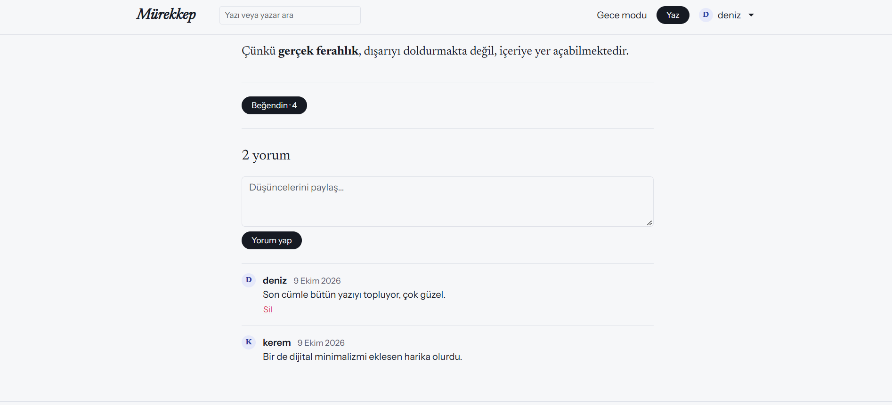

# 🖋️ Mürekkep-Blog

> Flask ile yazılmış, modern ve Substack benzeri bir blog platformu.

Mürekkep; kullanıcıların kayıt olup yazı yazabildiği, birbirini takip edebildiği, yazıları beğenip yorum yapabildiği zengin özellikli bir blog uygulamasıdır.

## 📸 Ekran Görüntüleri

| Karşılama / Ana Sayfa | Keşfet / Akış | Profil Sayfası |
| :---: | :---: | :---: |
|  |  |  |

| Yazı Detay | Yeni Yazı | Beğeni & Yorum | Gece Modu |
| :---: | :---: | :---: | :---: |
|  |  |  |  |

---

## ✨ Özellikler

- 🔐 **Gelişmiş Kimlik Doğrulama:** Kayıt / giriş / çıkış, "beni hatırla" mekanizması ve oturum yönetimi (`Flask-Login`).
- 🛡️ **Güvenlik Odaklı:** Passlib ile güvenli parola hashleme (`PBKDF2-SHA256`), CSRF koruması ve `Flask-WTF` ile form doğrulama.
- 📝 **Zengin İçerik Yönetimi:** Yazı oluşturma, düzenleme, silme, arama ve sayfalama (`pagination`) desteği.
- 🖋️ **Markdown & Güvenlik:** Taslak/yayınlanmış yazı yönetimi, Markdown desteği ve `bleach` ile güvenli HTML sanitizasyonu (okuma süresi hesaplama özelliği ile).
- 👥 **Sosyal Özellikler:** Yazar profilleri, takip sistemi ve "Takip ettiklerim" özel akışı.
- ❤️ **Etkileşim:** Yazılara beğeni bırakma ve yorum yapma.
- ⚙️ **Kullanıcı Deneyimi:** Parola değiştirme, profil açıklaması düzenleme ve göz yormayan **Gece Modu (Dark Mode)** desteği.
- 🗄️ **Veritabanı:** `SQLite` + `SQLAlchemy` (`blog.db` ilk çalıştırmada otomatik oluşur).

---

## 🗂️ Proje Yapısı

```
Murekkep-Blog/
├── app.py            # Uygulama kurulumu ve rotalar (routes)
├── models.py         # Veritabanı nesnesi ve modeller (User, Post, Comment, Like)
├── forms.py          # Form sınıfları ve doğrulayıcılar
├── utils.py          # Şablon filtreleri ve yardımcı fonksiyonlar
├── requirements.txt  # Bağımlılıklar
├── templates/        # HTML şablonları
├── static/           # CSS
└── images/           # README ekran görüntüleri
```

---

## 🚀 Hızlı Başlangıç & Kurulum

Projeyi kendi bilgisayarınızda çalıştırmak için terminalinizde şu adımları takip edin:

```bash
# Depoyu klonlayın
git clone https://github.com/ecrin404/Murekkep-Blog.git
cd Murekkep-Blog

# Sanal ortam oluşturun ve aktifleştirin
python -m venv venv
venv\Scripts\activate        # Windows için
source venv/bin/activate     # macOS / Linux için

# Bağımlılıkları yükleyin
pip install -r requirements.txt

# Uygulamayı başlatın
python app.py
```
Tarayıcınızda http://127.0.0.1:5000 adresini açarak uygulamayı inceleyebilirsiniz.

> Boş bir veritabanıyla başlarsan ana sayfada yazı görünmez. Örnek veri için:
> `flask --app app seed`
> (kullanıcılar: `deniz`, `ada`, `kerem`, `mira`, `selin` — hepsinin parolası: `parola123`)


